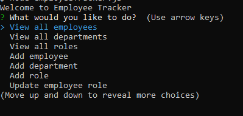
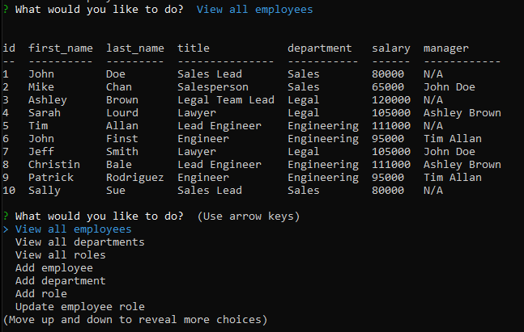

# Homework Assignment - Unit 12 MySQL Homework: Employee Tracker

## Table of Contents
[Description](#description)

[Key Features](#key-features)

[License](#license)

[Walkthrough Video](#walkthrough-video)

[Screenshots](#screenshots)

## Description
The focus of this homework assignment for the University of Toronto SCS Coding Boot Camp was to to architect and build a solution for managing a company's employees using node, inquirer, and MySQL.

## Key Features
- Application uses the inquirer package available from [npm](https://www.npmjs.com/package/inquirer) that allows for the command line prompts and user responses to be captured.
- Application uses the mysql package available at [npm](https://www.npmjs.com/package/mysql) to connect to the MySQL database and perform queries

## Walkthrough Video
The following video demonstrates the application's functionality.
- [Video]()

## License
This product is under the MIT License.

## Screenshots
The images below show aspects of the application including prompts at the command line for the user, ADD MORE.

